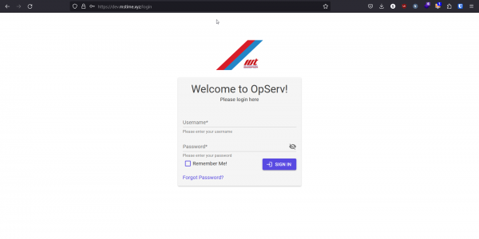
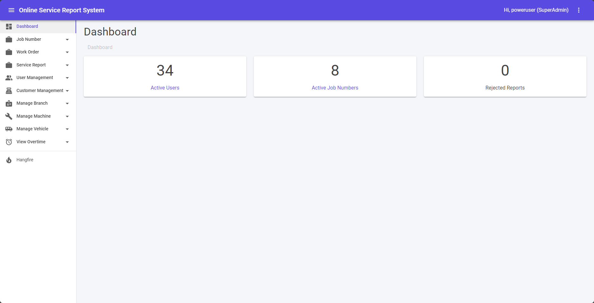

Guides lead a user through a specific task they want to accomplish, often with a sequence of steps.
Writing a good guide requires thinking about what your users are trying to do.

## Login

1. Access to Login Screen for OpServ System as stated in Server Access.
2. Click **[Remember Me!]** check box to access the system without log in next time.
3. Click **[Forgot Password?]** link in case don’t remember username and password.
4. Fill in your own username and password. Then, click **[SIGN IN]** button.

## Forgot Password

1. Click **[Back to login]** link if want to go back to Login.
2. Fill in email address and click **[SUBMIT]** button.

## Dashboard

1. There are information of Active Users, Active Job Numbers and Rejected Reports.
2. Click **[Active Users]** link will navigate to Users List.
3. Click **[Active Job Numbers]** link will navigate to Job Number List.

