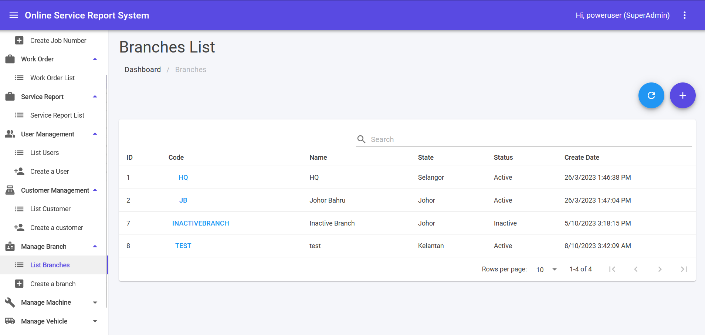
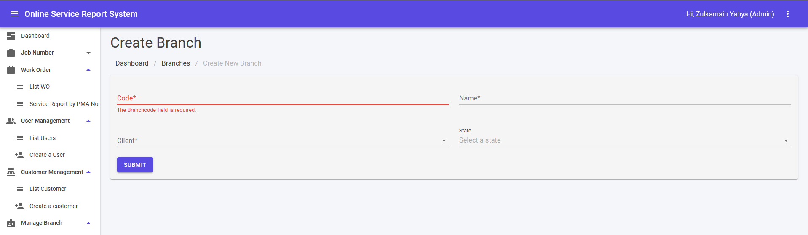

## Branch List

1. This module can be accessed by clicking Manage Branch> List Branches link on the sidebar.
2. Fill in keyword in search text area and click [Enter] button to filter branches list.
3. Click on any branch name to edit branch details.
4. ↻ icon is for refresh Branches List.
5. Click ➕ icon to Create Branch.

## Create New Branch

An admin can use this function to create company's branch in the system. All other modules will be filtered as registered user's branch.

1. This module can be accessed directly from the Manage Branch > Create a branch link on the sidebar.
2. Fill in accordingly and click **SUBMIT** to create a new branch.
3. Error message in red colour will be shown if error exist during submit.
4. Success message will be shown in green colour if submit is success.

