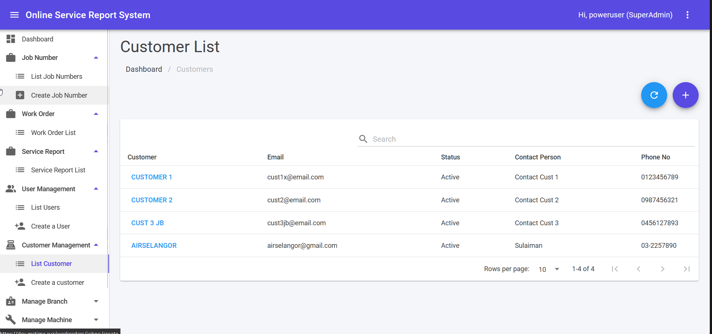
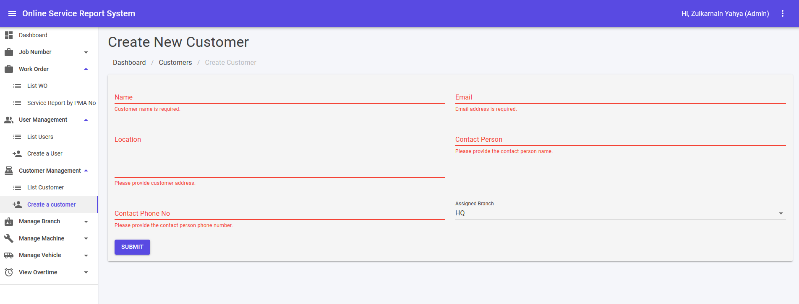

## Customer List

1. This module can be accessed by clicking Customer Management > List Customers link on the sidebar.
2. Fill in keyword in search text area and click **Enter** button to filter customer list.
3. Click on any **Customer Name** to edit a Customer.
4. Use ↻ icon is for refresh Customer List.
5. Click ➕ icon to Create New Customer.

## Create New Customer

1. This module can be accessed directly from the User Management > Create a customer link on the sidebar.
2. Fill in accordingly and click **SUBMIT** to create a new customer.
3. Error message in red colour will be shown if error exist during submit.
4. Success message will be shown in green colour if submit is success.

*All required fields must be filled by user before submitting.*