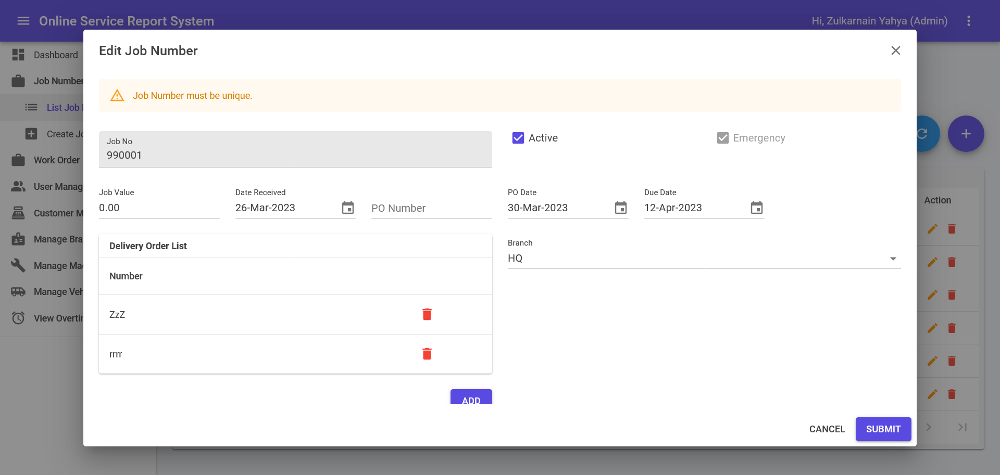

## Job Number List

1. This module can be accessed by clicking Job Number > List Job Numbers link on the sidebar.
2. ➕ icon is for create new Job Number. Page will be navigated to Create Job Numbers page.
3. Clicking a **Job Number** will triggger editing page.
4. Toggle under “Is Active” column is for set Job Number is active or inactive.

## Create/Edit Job Number
 
1. Create Job Numbers can be accessed directly by clicking Job Number > Create Job Numbers.
2. Click **Add** button to add Delivery Order.
3. 🗑️ icon is for deleting Delivery Order.
4. Attachment can be uploaded by click the box and browse file pop up will appear or drag directly file to the box.
5. After Fill in necessary information, click **SUBMIT** button to save Job Number’s information.
6. Error message in red colour will be shown if error exist during submit.
7. Success message will be shown in green colour if submit is success.
8. Clicking **CANCEL** button will navigate to the Job Number List.

