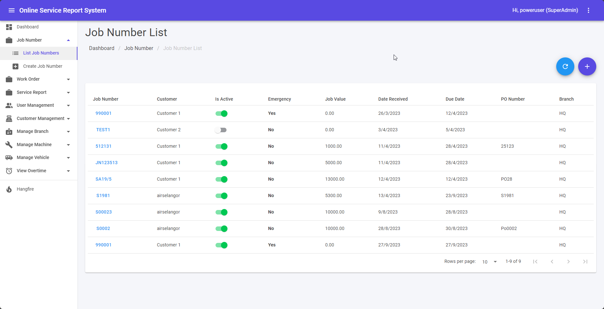

Guides lead a user through a specific task they want to accomplish, often with a sequence of steps.
Writing a good guide requires thinking about what your users are trying to do.

## Job Number List

1. This module can be accessed by clicking Job Number > List Job Numbers link on the sidebar.
2. ➕ icon is for create new Job Number. Page will be navigated to Create Job Numbers page.
3. Clicking a Job Number will triggger editing page.
4. Toggle under “Is Active” column is for set Job Number is active or inactive.

