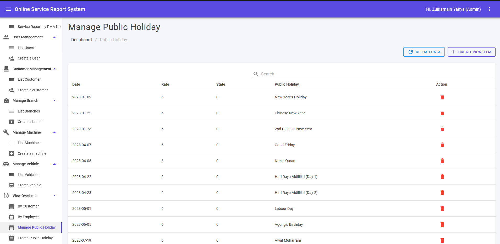

## Manage Public Holiday

Admin can manage Public Holiday from this module. If a day has been set to Public Holiday, overtime calculation will be counted as 2.0 for hourly bill. 

1. This module can be accessed from the View Overtime > Manage Public Holiday link on the sidebar.
2. Fill in keyword in search text area and click **Enter** button to filter more public holiday.
3. 🗑️ icon is for delete public holiday data in the same row.
4. **RELOAD DATA** button is for refresh Manage Public Holiday page.
5. **CREATE NEW ITEM** button is for set new public holiday. It will navigate to Create Public Holiday.

## Create Public Holiday

1. This module can be accessed directly from the View Overtime > Create Public Holiday link on the sidebar.
2. Date can be choose from calendar. Fill in accordingly and click **SUBMIT** to set a new public holiday.
3. Error message in red colour will be shown if error exist during submit.
4. Success message will be shown in green colour if submit is success.
5. Clicking **CANCEL** button will navigate back to the Manage Public Holiday page.

