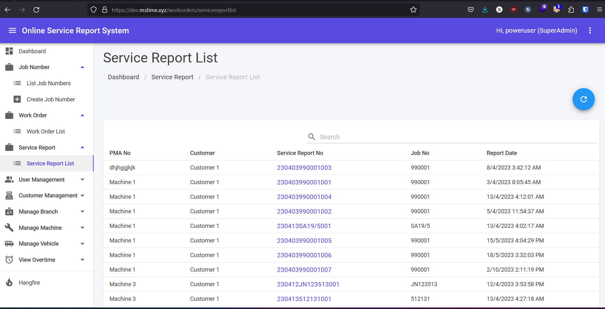

## Service Report List

1. This module can be accessed by clicking **Service Report List** link on the sidebar.
2. Clicking any **Service Report No link** will navigate to view Service Report.

## Service Repair Summary: Download PDF

1. Open any **Service Report** under the Service Report list.
2. Scroll until bottom of the page to see **VIEW SUMMARY** button, and then click it.
3. Clicking **DOWNLOAD PDF** will download the Service Report Summary Report as PDF format.

*Under View Service Report, scroll down until you seen VIEW SUMMARY button. Click the button to view the summary.*

*Scroll to bottom and you will see DOWNLOAD PDF button. Click it to download PDF file.*