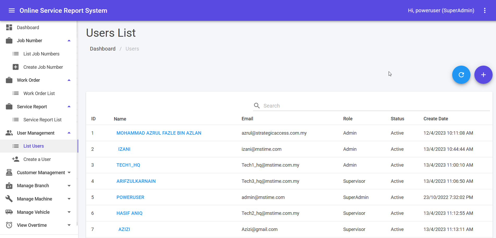
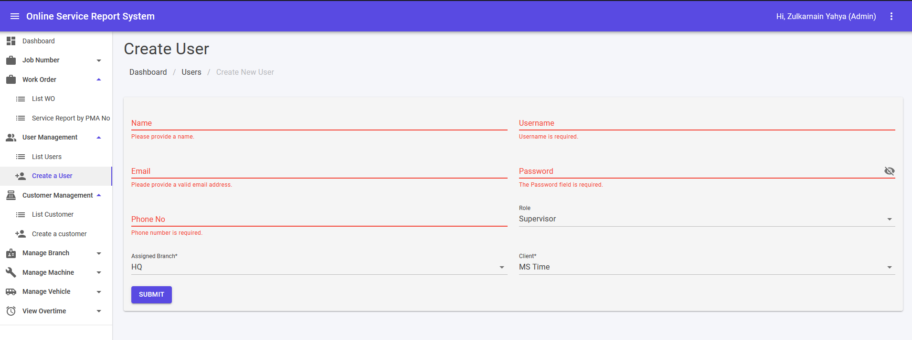

## User List

1. This module can be accessed by clicking User Management > List Users link on the sidebar.
2. Fill in keyword in search text area and click **Enter**]** button to filter user list.
3. ✏️ icon is for editing information belong to User in the same row.It will navigate to Edit User page.
4. 🗑️ icon is for delete information belong to User in the same row.
5. ↻ icon is for refresh User List.
6. Clicking ➕ icon will navigate to Create New User.

## Create New User

1. This module can be accessed directly from the User Management > Create a user link on the sidebar.
2. Fill in accordingly and click **SUBMIT** to create a new user.
3. Error message in red colour will be shown if error exist during submit.
4. Success message will be shown in green colour if submit is success.

*All required fields must be filled by user before submitting.*