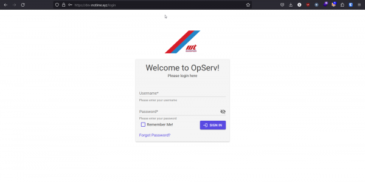
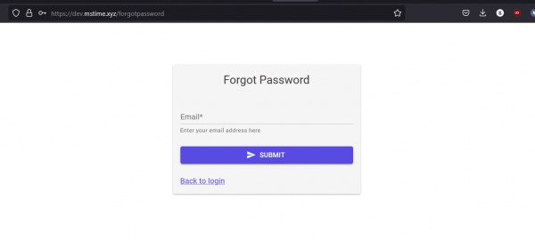
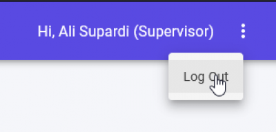

## Login

1. Access to Login Screen for OpServ System as stated in Server Access.
2. Click **[Remember Me!]** check box to access the system without log in next time.
3. Click **[Forgot Password?]** link in case don’t remember username and password.
4. Fill in your own username and password. Then, click **[SIGN IN]** button.

## Forgot Password

1. Click **[Back to login]** link if want to go back to Login.
2. Fill in email address and click **[SUBMIT]** button.

## Log Out

1. Click 3 dot beside username on the top right. Then, click logout link.
2. After logout, page will be navigated to the login page.

