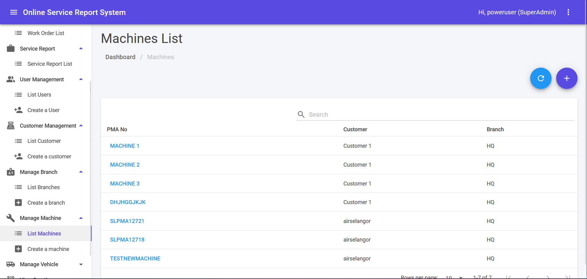
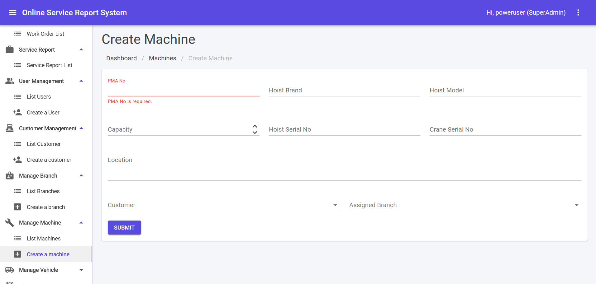

## Machine List

1. This module can be accessed by clicking Manage Machine > List Machine link on the sidebar.
2. Fill in keyword in search text area and click **Enter** button to filter machines list.
3. Click on any **Machine Name** to edit a Machine.
4. ↻ icon is for refresh Machines List.
5. Click ➕ icon to Create Machine.

## Create a Machine

1. This module can be accessed directly from the Manage Machine > Create a machine link on the sidebar.
2. Fill in accordingly and click **SUBMIT** to create a new machine.
3. Error message in red colour will be shown if error exist during submit.
4. Success message will be shown in green colour if submit is success.

:::caution[Restriction on Machine name]
Machine name field can only accept:
1. Capital letters
2. Numbers
3. No space
:::

