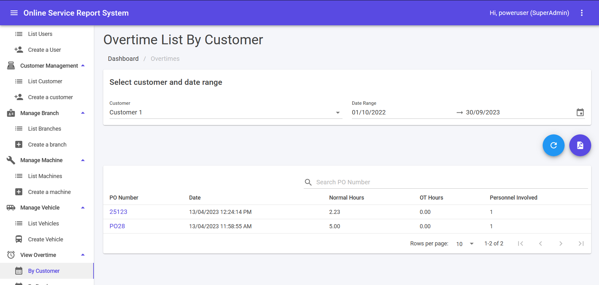
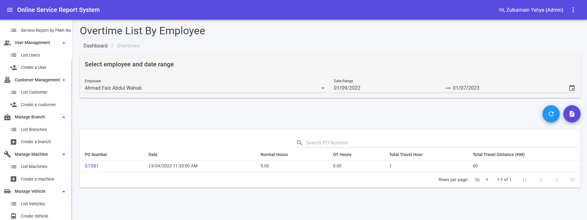

:::note[Overtime Rate Calculation]
Overtime rate will only be counted based on below conditions.
1. PO Number must be assigned to the Job Number.
2. Work Order status must be **Closed**.

:::

## Overtime List By Customer

1. This module can be accessed from the View Overtime > By customer link on the sidebar.
2. Customer can be selected from drop down list and Date range is choose from pop up calendar. Then, result list will appear.
3. Fill in keyword in search text area and click **Enter** button to filter more on overtime list.
4. Click on the **PO Number** link will navigate to Edit Work Order.
5. ↻ icon is for Overtime List By Customer.
6. 🗎PDF icon for downloading PDF format of Overtime List By Customer.

## Overtime List By Employee

1. This module can be accessed from the View Overtime > By employee link on the sidebar.
2. Employee can be selected from drop down list and Date range is choose from pop up calendar. Then, result list will appear.
3. Fill in keyword in search text area and click [Enter] button to filter more on overtime list.
4. Click on the Work Order link will navigate to Edit Work Order.
5. ↻ icon is for Overtime List By Employee.
6. 🗎PDF icon for downloading PDF format of Overtime List By Employee.

