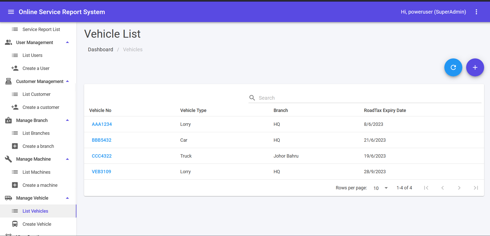
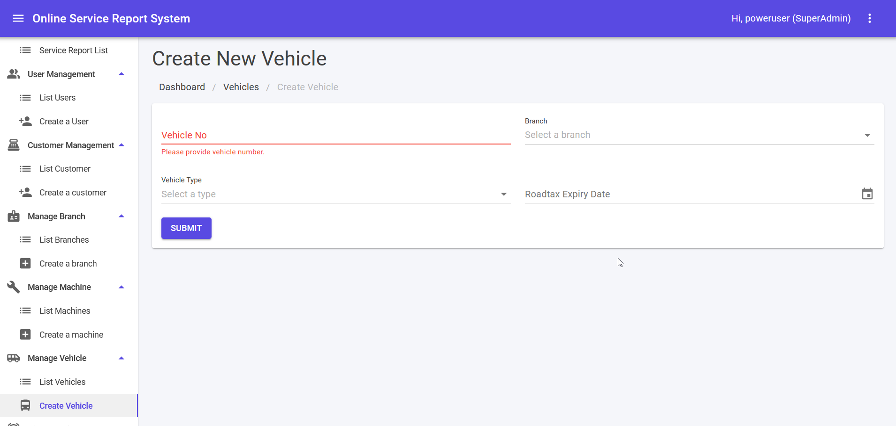

## Vehicle List

1. This module can be accessed by clicking Manage Vehicle > List Vehicle link on the sidebar.
2. Fill in keyword in search text area and click **Enter** button to filter vehicles list.
3. Click on any **Machine Name** to edit a Machine.
4. ↻ icon is for refresh Vehicle List.
5. Click ➕ icon to create new vehicle.

## Create New Vehicle

1. This module can be accessed directly from the Manage Vehicle > Create Vehicle link on the sidebar.
2. Fill in accordingly and click **SUBMIT** to create a new vehicle.
3. Error message in red colour will be shown if error exist during submit.
4. Success message will be shown in green colour if submit is success.

