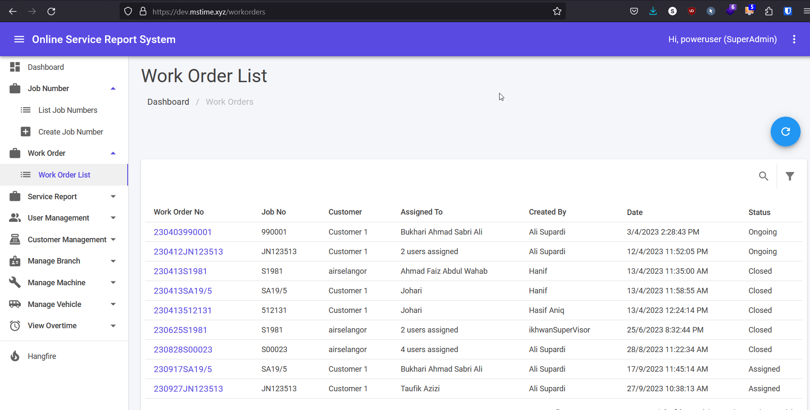
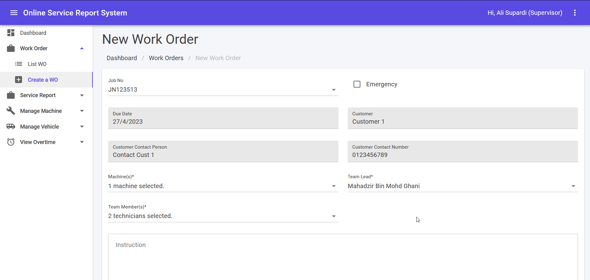
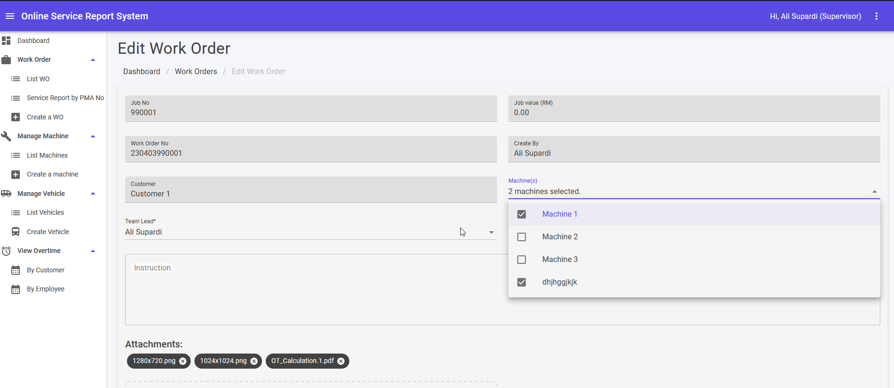

## Work Order List

1. This module can be accessed by clicking Work Orders > List WO link on the sidebar.
2. Click link under “Work Order No” to see more information belong to the Work Order No. It will lead to Edit Work Order page.
3. Click 🔍 icon to open search text box.
4. Fill in search text box to filter Work Order No by keywords and click **Enter** button.
5. Click **Filter** button to filter Work Order No by status.

## Create Work Order

1. Select Job No from drop down list.
2. Due Date, Customer information and others which belong to Job No will be shown automatically.
3. Machines are selected by check the checkboxes in drop down list.
4. Team members are selected by check the checkboxes in drop down list.
5. Select team leader from drop list.
6. Upload the attachment by drag and drop or browse the file.
7. Click **CREATE WORK ORDER** to create a new work order.
8. Click **BACK TO LIST** to go back to the previous page.

:::caution[Need to create emergency work order?]
Please ask any user with administrator permission to create ***Emergency Job Number***. After that, you can select the emergency Job Number from selection list.
:::

## Edit Work Order

1. Click link under **Attachments** to download attachments.
2. Click **Service Report No** link will navigate to Edit Service Report.
3. Clicking **BACK TO LIST** button will navigate back to Work Order List.
4. Clicking **UPDATE** button will update info of Work Order No.
5. Clicking **CANCEL** button will delete the Work Order No.
6. Clicking **CREATE SERVICE REPORT** will create a new service report. It will lead to [Create Service Report Page](/supervisor/servicereport/).

