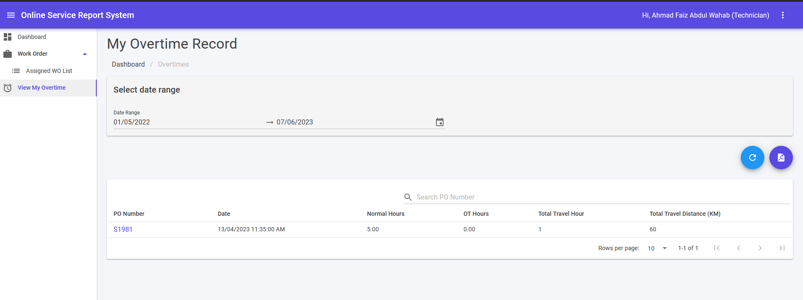

## My Overtime Record

1. This module can be accessed from the **View My Overtime** on the sidebar.
2. Choose Start and End Date from pop up calendar. Then, result list will appear.
3. Fill in keyword in search text area and click **Enter** button to filter more on overtime list.
4. 🔄 icon is for refresh results of overtime record.
5. 🗎PDF icon for downloading PDF format of Overtime record.

