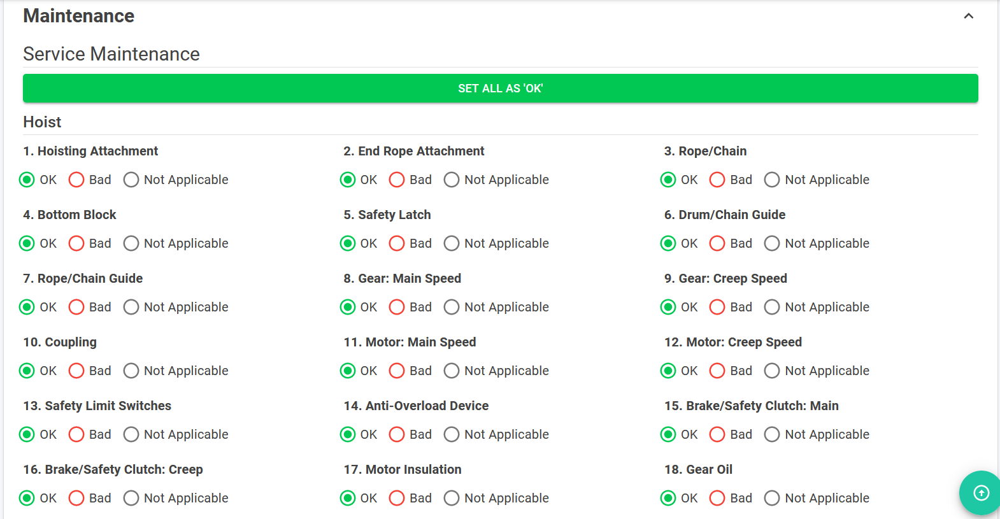

## Create Service Report

Select applicable report type(Maintenance Report, Repair Report , or Installation Report)

### Maintenance Report

1. Fill in Customer & Machine Information section.
2. Choose OK, Bad or Not Applicable in Maintenance section.
3. Click ***SET ALL AS OK*** if want to set all as ok.
4. If choose **Bad**, Hoist Attachment pop up will be shown.
5. After fill in Hoist Attachment, click **OK** button or **CANCEL** button.

*Create maintenance Service Report*

*Maintenance checklist*

*Clicking bad on the checklist will show add defect page*

### Repair Report

1. Fill in Customer & Machine Information section.
2. Fill in comment in Repair section.
3. Click **ADD** button to add Description & Quantity.
4. Click ✏️ icon to edit Description & Quantity.
5. Click **SAVE** button to add Description & Quantity.
6. Click **Cancel** button to cancel add Description & Quantity.
7. Click 🗑️ icon to delete Description & Quantity.

### Installation Report

1. Fill in Customer & Machine Information section.
2. Fill in comment in Repair section.
3. Click **ADD** button to add Description & Quantity.
4. Click ✏️ icon to edit Description & Quantity.
5. Click **SAVE** button to add Description & Quantity.
6. Click **Cancel** button to cancel add Description & Quantity.
7. Click 🗑️ icon to delete Description & Quantity.

## Finalizing Service Report

1. Fill in working hours in the Others section.
2. Drag or browse the file to upload attachment.
3. Click **SAVE** button to save.
4. Click **BACK TO WORK ORDER** button to back to previous page.

## Service Repair Summary: Download PDF

1. Open any **Service Report** under the Service Report list.
2. Scroll until bottom of the page to see **VIEW SUMMARY** button, and then click it.
3. Clicking **DOWNLOAD PDF** will download the Service Report Summary Report as PDF format.

*Under View Service Report, scroll down until you seen VIEW SUMMARY button. Click the button to view the summary.*

*Scroll to bottom and you will see DOWNLOAD PDF button. Click it to download PDF file.*