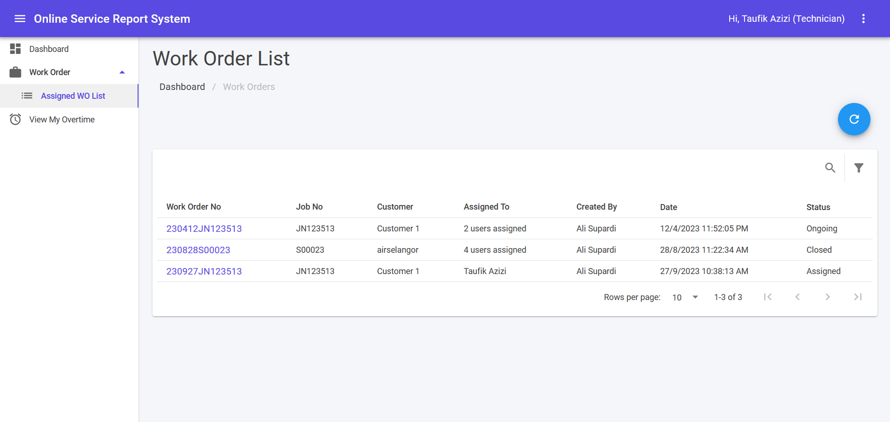
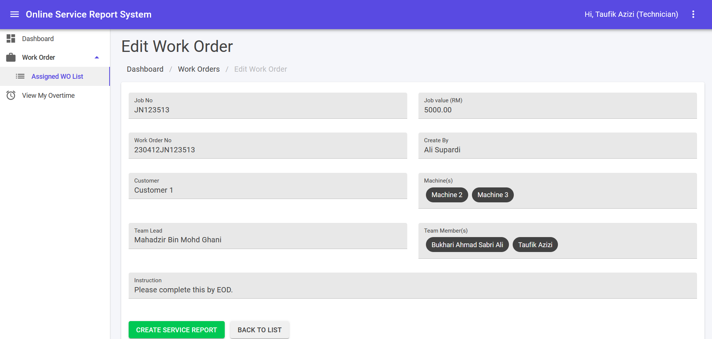

## Assigned Work Order List

You will be able to see assigned Work Order only. If desired Work Order cannot be seen, please consult your supervisor.

1. This module can be accessed by clicking Work Orders > Assigned WO List link on the sidebar.
2. Click link under “Work Order No” to see more information belong to the Work Order No. It will lead to Edit Work Order page.
3. Click 🔍 icon to open search text box.
4. Fill in search text box to filter Work Order No by keywords and click **Enter** button.
5. Click **Filter** button to filter Work Order No by status.

## Edit Work Order

1. Clicking **CREATE SERVICE REPORT** will create a new service report. It will lead to [Create Service Report Page](/technician/servicereport/).
2. Clicking **Service Report No** link under report list will navigate to Edit Service Report.
3. Clicking **BACK TO LIST** button will navigate back to Work Order List.

